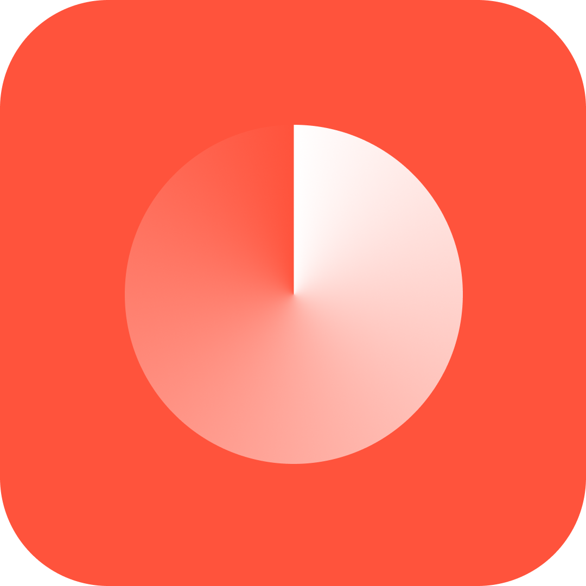

  

<h1 align="center">Counter</h1>

  
  

  Counter is an application that helps users count habits, goods, etc.

## ❓ Questions

### What is the project?
Counter is an application to counter actions, habits, items, etc.

### Why was this app developed?
I developed it as a case of the OneBrain selective process. They sent me a prototype and I decided to improve the project.

### Who developed the new UI?
[Darkton Hallisson](https://www.linkedin.com/in/darkton)

## 🚀 Technologies
- [React Native](https://reactnative.dev/) (CLI)
- [React Native Reanimated](https://docs.swmansion.com/react-native-reanimated/)
- [Moti](https://moti.fyi/animations)

I even used [RealmDB](https://realm.io/) but I didn't see the need so I decided to use [AsyncStorage](https://reactnative.dev/docs/asyncstorage).

## 🖼 Prototype
[Figma](https://www.figma.com/file/4zEwCmw0J2qPTyvbdMamHB/Counter-Project?node-id=0%3A1)

## 📱 Application result (IOS)
